```mermaid
flowchart TB
    subgraph upstream["Dependants (1)"]
        P1["<b>📦&nbsp;AspireApp1.AppHost.csproj</b><br/><small>net9.0</small>"]
        click P1 "#aspireapp1apphostaspireapp1apphostcsproj"
    end
    subgraph current["AspireApp1.ApiService.csproj"]
        MAIN["<b>📦&nbsp;AspireApp1.ApiService.csproj</b><br/><small>net9.0</small>"]
        click MAIN "#aspireapp1apiserviceaspireapp1apiservicecsproj"
    end
    subgraph downstream["Dependencies (1"]
        P2["<b>📦&nbsp;AspireApp1.ServiceDefaults.csproj</b><br/><small>net9.0</small>"]
        click P2 "#aspireapp1servicedefaultsaspireapp1servicedefaultscsproj"
    end
    P1 --> MAIN
    MAIN --> P2

```

```mermaid
flowchart TB
    subgraph upstream["Dependants (1)"]
        P5["<b>📦&nbsp;AspireApp1.Tests.csproj</b><br/><small>net9.0</small>"]
        click P5 "#aspireapp1testsaspireapp1testscsproj"
    end
    subgraph current["AspireApp1.AppHost.csproj"]
        MAIN["<b>📦&nbsp;AspireApp1.AppHost.csproj</b><br/><small>net9.0</small>"]
        click MAIN "#aspireapp1apphostaspireapp1apphostcsproj"
    end
    subgraph downstream["Dependencies (3"]
        P3["<b>📦&nbsp;AspireApp1.ApiService.csproj</b><br/><small>net9.0</small>"]
        P4["<b>📦&nbsp;AspireApp1.FrontEnd.csproj</b><br/><small>net9.0</small>"]
        P6["<b>📦&nbsp;AspireApp1.BackEnd.csproj</b><br/><small>net9.0</small>"]
        click P3 "#aspireapp1apiserviceaspireapp1apiservicecsproj"
        click P4 "#aspireapp1webaspireapp1frontendcsproj"
        click P6 "#aspireapp1dbapiaspireapp1backendcsproj"
    end
    P5 --> MAIN
    MAIN --> P3
    MAIN --> P4
    MAIN --> P6

```

```mermaid
flowchart TB
    subgraph upstream["Dependants (1)"]
        P1["<b>📦&nbsp;AspireApp1.AppHost.csproj</b><br/><small>net9.0</small>"]
        click P1 "#aspireapp1apphostaspireapp1apphostcsproj"
    end
    subgraph current["AspireApp1.BackEnd.csproj"]
        MAIN["<b>📦&nbsp;AspireApp1.BackEnd.csproj</b><br/><small>net9.0</small>"]
        click MAIN "#aspireapp1dbapiaspireapp1backendcsproj"
    end
    subgraph downstream["Dependencies (1"]
        P2["<b>📦&nbsp;AspireApp1.ServiceDefaults.csproj</b><br/><small>net9.0</small>"]
        click P2 "#aspireapp1servicedefaultsaspireapp1servicedefaultscsproj"
    end
    P1 --> MAIN
    MAIN --> P2

```

```mermaid
flowchart TB
    subgraph upstream["Dependants (3)"]
        P3["<b>📦&nbsp;AspireApp1.ApiService.csproj</b><br/><small>net9.0</small>"]
        P4["<b>📦&nbsp;AspireApp1.FrontEnd.csproj</b><br/><small>net9.0</small>"]
        P6["<b>📦&nbsp;AspireApp1.BackEnd.csproj</b><br/><small>net9.0</small>"]
        click P3 "#aspireapp1apiserviceaspireapp1apiservicecsproj"
        click P4 "#aspireapp1webaspireapp1frontendcsproj"
        click P6 "#aspireapp1dbapiaspireapp1backendcsproj"
    end
    subgraph current["AspireApp1.ServiceDefaults.csproj"]
        MAIN["<b>📦&nbsp;AspireApp1.ServiceDefaults.csproj</b><br/><small>net9.0</small>"]
        click MAIN "#aspireapp1servicedefaultsaspireapp1servicedefaultscsproj"
    end
    P3 --> MAIN
    P4 --> MAIN
    P6 --> MAIN

```

```mermaid
flowchart TB
    subgraph current["AspireApp1.Tests.csproj"]
        MAIN["<b>📦&nbsp;AspireApp1.Tests.csproj</b><br/><small>net9.0</small>"]
        click MAIN "#aspireapp1testsaspireapp1testscsproj"
    end
    subgraph downstream["Dependencies (1"]
        P1["<b>📦&nbsp;AspireApp1.AppHost.csproj</b><br/><small>net9.0</small>"]
        click P1 "#aspireapp1apphostaspireapp1apphostcsproj"
    end
    MAIN --> P1

```

```mermaid
flowchart TB
    subgraph upstream["Dependants (1)"]
        P1["<b>📦&nbsp;AspireApp1.AppHost.csproj</b><br/><small>net9.0</small>"]
        click P1 "#aspireapp1apphostaspireapp1apphostcsproj"
    end
    subgraph current["AspireApp1.FrontEnd.csproj"]
        MAIN["<b>📦&nbsp;AspireApp1.FrontEnd.csproj</b><br/><small>net9.0</small>"]
        click MAIN "#aspireapp1webaspireapp1frontendcsproj"
    end
    subgraph downstream["Dependencies (1"]
        P2["<b>📦&nbsp;AspireApp1.ServiceDefaults.csproj</b><br/><small>net9.0</small>"]
        click P2 "#aspireapp1servicedefaultsaspireapp1servicedefaultscsproj"
    end
    P1 --> MAIN
    MAIN --> P2

```

# Projects and dependencies analysis

This document provides a comprehensive overview of the projects and their dependencies in the context of upgrading to .NETCoreApp,Version=v10.0.

## Table of Contents

- [Executive Summary](#executive-Summary)
  - [Highlevel Metrics](#highlevel-metrics)
  - [Projects Compatibility](#projects-compatibility)
  - [Package Compatibility](#package-compatibility)
  - [API Compatibility](#api-compatibility)
- [Aggregate NuGet packages details](#aggregate-nuget-packages-details)
- [Top API Migration Challenges](#top-api-migration-challenges)
  - [Technologies and Features](#technologies-and-features)
  - [Most Frequent API Issues](#most-frequent-api-issues)
- [Projects Relationship Graph](#projects-relationship-graph)
- [Project Details](#project-details)

  - [AspireApp1.ApiService\AspireApp1.ApiService.csproj](#aspireapp1apiserviceaspireapp1apiservicecsproj)
  - [AspireApp1.AppHost\AspireApp1.AppHost.csproj](#aspireapp1apphostaspireapp1apphostcsproj)
  - [AspireApp1.DbApi\AspireApp1.BackEnd.csproj](#aspireapp1dbapiaspireapp1backendcsproj)
  - [AspireApp1.ServiceDefaults\AspireApp1.ServiceDefaults.csproj](#aspireapp1servicedefaultsaspireapp1servicedefaultscsproj)
  - [AspireApp1.Tests\AspireApp1.Tests.csproj](#aspireapp1testsaspireapp1testscsproj)
  - [AspireApp1.Web\AspireApp1.FrontEnd.csproj](#aspireapp1webaspireapp1frontendcsproj)

## Executive Summary

### Highlevel Metrics

| Metric | Count | Status |
| :--- | :---: | :--- |
| Total Projects | 6 | All require upgrade |
| Total NuGet Packages | 16 | 10 need upgrade |
| Total Code Files | 37 |  |
| Total Code Files with Incidents | 14 |  |
| Total Lines of Code | 2441 |  |
| Total Number of Issues | 59 |  |
| Estimated LOC to modify | 39+ | at least 1.6% of codebase |

### Projects Compatibility

| Project | Target Framework | Difficulty | Package Issues | API Issues | Est. LOC Impact | Description |
| :--- | :---: | :---: | :---: | :---: | :---: | :--- |
| [AspireApp1.ApiService\AspireApp1.ApiService.csproj](#aspireapp1apiserviceaspireapp1apiservicecsproj) | net9.0 | 🟢 Low | 1 | 1 | 1+ | AspNetCore, Sdk Style = True |
| [AspireApp1.AppHost\AspireApp1.AppHost.csproj](#aspireapp1apphostaspireapp1apphostcsproj) | net9.0 | 🟢 Low | 2 | 0 |  | DotNetCoreApp, Sdk Style = True |
| [AspireApp1.DbApi\AspireApp1.BackEnd.csproj](#aspireapp1dbapiaspireapp1backendcsproj) | net9.0 | 🟢 Low | 3 | 1 | 1+ | AspNetCore, Sdk Style = True |
| [AspireApp1.ServiceDefaults\AspireApp1.ServiceDefaults.csproj](#aspireapp1servicedefaultsaspireapp1servicedefaultscsproj) | net9.0 | 🟢 Low | 5 | 0 |  | ClassLibrary, Sdk Style = True |
| [AspireApp1.Tests\AspireApp1.Tests.csproj](#aspireapp1testsaspireapp1testscsproj) | net9.0 | 🟢 Low | 2 | 1 | 1+ | DotNetCoreApp, Sdk Style = True |
| [AspireApp1.Web\AspireApp1.FrontEnd.csproj](#aspireapp1webaspireapp1frontendcsproj) | net9.0 | 🟢 Low | 1 | 36 | 36+ | AspNetCore, Sdk Style = True |

### Package Compatibility

| Status | Count | Percentage |
| :--- | :---: | :---: |
| ✅ Compatible | 6 | 37.5% |
| ⚠️ Incompatible | 0 | 0.0% |
| 🔄 Upgrade Recommended | 10 | 62.5% |
| ***Total NuGet Packages*** | ***16*** | ***100%*** |

### API Compatibility

| Category | Count | Impact |
| :--- | :---: | :--- |
| 🔴 Binary Incompatible | 0 | High - Require code changes |
| 🟡 Source Incompatible | 1 | Medium - Needs re-compilation and potential conflicting API error fixing |
| 🔵 Behavioral change | 38 | Low - Behavioral changes that may require testing at runtime |
| ✅ Compatible | 9672 |  |
| ***Total APIs Analyzed*** | ***9711*** |  |

## Aggregate NuGet packages details

| Package | Current Version | Suggested Version | Projects | Description |
| :--- | :---: | :---: | :--- | :--- |
| Aspire.Hosting.AppHost | 9.0.0 | 13.1.0 | [AspireApp1.AppHost.csproj](#aspireapp1apphostaspireapp1apphostcsproj) | NuGet パッケージのアップグレードをおすすめします |
| Aspire.Hosting.Testing | 9.0.0 | 13.1.0 | [AspireApp1.Tests.csproj](#aspireapp1testsaspireapp1testscsproj) | NuGet パッケージのアップグレードをおすすめします |
| Microsoft.AspNetCore.Authentication.Negotiate | 8.0.0 | 10.0.1 | [AspireApp1.BackEnd.csproj](#aspireapp1dbapiaspireapp1backendcsproj) [AspireApp1.FrontEnd.csproj](#aspireapp1webaspireapp1frontendcsproj) | NuGet パッケージのアップグレードをおすすめします |
| Microsoft.AspNetCore.OpenApi | 9.0.0 | 10.0.1 | [AspireApp1.ApiService.csproj](#aspireapp1apiserviceaspireapp1apiservicecsproj) | NuGet パッケージのアップグレードをおすすめします |
| Microsoft.EntityFrameworkCore.Design | 8.0.12 | 10.0.1 | [AspireApp1.BackEnd.csproj](#aspireapp1dbapiaspireapp1backendcsproj) | NuGet パッケージのアップグレードをおすすめします |
| Microsoft.EntityFrameworkCore.Tools | 8.0.12 | 10.0.1 | [AspireApp1.BackEnd.csproj](#aspireapp1dbapiaspireapp1backendcsproj) | NuGet パッケージのアップグレードをおすすめします |
| Microsoft.Extensions.Http.Resilience | 9.0.0 | 10.1.0 | [AspireApp1.ServiceDefaults.csproj](#aspireapp1servicedefaultsaspireapp1servicedefaultscsproj) | NuGet パッケージのアップグレードをおすすめします |
| Microsoft.Extensions.ServiceDiscovery | 9.0.0 | 10.1.0 | [AspireApp1.ServiceDefaults.csproj](#aspireapp1servicedefaultsaspireapp1servicedefaultscsproj) | NuGet パッケージのアップグレードをおすすめします |
| MSTest | 3.4.3 |  | [AspireApp1.Tests.csproj](#aspireapp1testsaspireapp1testscsproj) | ✅Compatible |
| Npgsql.EntityFrameworkCore.PostgreSQL | 8.0.8 |  | [AspireApp1.BackEnd.csproj](#aspireapp1dbapiaspireapp1backendcsproj) | ✅Compatible |
| OpenTelemetry.Exporter.OpenTelemetryProtocol | 1.9.0 |  | [AspireApp1.ServiceDefaults.csproj](#aspireapp1servicedefaultsaspireapp1servicedefaultscsproj) | ✅Compatible |
| OpenTelemetry.Extensions.Hosting | 1.9.0 |  | [AspireApp1.ServiceDefaults.csproj](#aspireapp1servicedefaultsaspireapp1servicedefaultscsproj) | ✅Compatible |
| OpenTelemetry.Instrumentation.AspNetCore | 1.9.0 | 1.14.0 | [AspireApp1.ServiceDefaults.csproj](#aspireapp1servicedefaultsaspireapp1servicedefaultscsproj) | NuGet パッケージのアップグレードをおすすめします |
| OpenTelemetry.Instrumentation.Http | 1.9.0 | 1.14.0 | [AspireApp1.ServiceDefaults.csproj](#aspireapp1servicedefaultsaspireapp1servicedefaultscsproj) | NuGet パッケージのアップグレードをおすすめします |
| OpenTelemetry.Instrumentation.Runtime | 1.9.0 |  | [AspireApp1.ServiceDefaults.csproj](#aspireapp1servicedefaultsaspireapp1servicedefaultscsproj) | ✅Compatible |
| Swashbuckle.AspNetCore | 6.5.0 |  | [AspireApp1.BackEnd.csproj](#aspireapp1dbapiaspireapp1backendcsproj) | ✅Compatible |

## Top API Migration Challenges

### Technologies and Features

| Technology | Issues | Percentage | Migration Path |
| :--- | :---: | :---: | :--- |

### Most Frequent API Issues

| API | Count | Percentage | Category |
| :--- | :---: | :---: | :--- |
| T:System.Uri | 18 | 46.2% | Behavioral Change |
| T:System.Net.Http.HttpContent | 9 | 23.1% | Behavioral Change |
| M:System.Uri.#ctor(System.String) | 8 | 20.5% | Behavioral Change |
| M:Microsoft.AspNetCore.Builder.ExceptionHandlerExtensions.UseExceptionHandler(Microsoft.AspNetCore.Builder.IApplicationBuilder) | 1 | 2.6% | Behavioral Change |
| M:Microsoft.AspNetCore.Builder.ExceptionHandlerExtensions.UseExceptionHandler(Microsoft.AspNetCore.Builder.IApplicationBuilder,System.String) | 1 | 2.6% | Behavioral Change |
| M:Microsoft.AspNetCore.Builder.ExceptionHandlerExtensions.UseExceptionHandler(Microsoft.AspNetCore.Builder.IApplicationBuilder,System.String,System.Boolean) | 1 | 2.6% | Behavioral Change |
| M:System.TimeSpan.FromSeconds(System.Int64) | 1 | 2.6% | Source Incompatible |

## Projects Relationship Graph

Legend:
📦 SDK-style project
⚙️ Classic project

```mermaid
flowchart LR
    P1["<b>📦&nbsp;AspireApp1.AppHost.csproj</b><br/><small>net9.0</small>"]
    P2["<b>📦&nbsp;AspireApp1.ServiceDefaults.csproj</b><br/><small>net9.0</small>"]
    P3["<b>📦&nbsp;AspireApp1.ApiService.csproj</b><br/><small>net9.0</small>"]
    P4["<b>📦&nbsp;AspireApp1.FrontEnd.csproj</b><br/><small>net9.0</small>"]
    P5["<b>📦&nbsp;AspireApp1.Tests.csproj</b><br/><small>net9.0</small>"]
    P6["<b>📦&nbsp;AspireApp1.BackEnd.csproj</b><br/><small>net9.0</small>"]
    P1 --> P3
    P1 --> P4
    P1 --> P6
    P3 --> P2
    P4 --> P2
    P5 --> P1
    P6 --> P2
    click P1 "#aspireapp1apphostaspireapp1apphostcsproj"
    click P2 "#aspireapp1servicedefaultsaspireapp1servicedefaultscsproj"
    click P3 "#aspireapp1apiserviceaspireapp1apiservicecsproj"
    click P4 "#aspireapp1webaspireapp1frontendcsproj"
    click P5 "#aspireapp1testsaspireapp1testscsproj"
    click P6 "#aspireapp1dbapiaspireapp1backendcsproj"

```

## Project Details

### AspireApp1.ApiService\AspireApp1.ApiService.csproj

#### Project Info

- **Current Target Framework:** net9.0
- **Proposed Target Framework:** net10.0
- **SDK-style**: True
- **Project Kind:** AspNetCore
- **Dependencies**: 1
- **Dependants**: 1
- **Number of Files**: 3
- **Number of Files with Incidents**: 2
- **Lines of Code**: 25
- **Estimated LOC to modify**: 1+ (at least 4.0% of the project)

#### Dependency Graph

Legend:
📦 SDK-style project
⚙️ Classic project

### API Compatibility

| Category | Count | Impact |
| :--- | :---: | :--- |
| 🔴 Binary Incompatible | 0 | High - Require code changes |
| 🟡 Source Incompatible | 0 | Medium - Needs re-compilation and potential conflicting API error fixing |
| 🔵 Behavioral change | 1 | Low - Behavioral changes that may require testing at runtime |
| ✅ Compatible | 30 |  |
| ***Total APIs Analyzed*** | ***31*** |  |

### AspireApp1.AppHost\AspireApp1.AppHost.csproj

#### Project Info

- **Current Target Framework:** net9.0
- **Proposed Target Framework:** net10.0
- **SDK-style**: True
- **Project Kind:** DotNetCoreApp
- **Dependencies**: 3
- **Dependants**: 1
- **Number of Files**: 1
- **Number of Files with Incidents**: 1
- **Lines of Code**: 15
- **Estimated LOC to modify**: 0+ (at least 0.0% of the project)

#### Dependency Graph

Legend:
📦 SDK-style project
⚙️ Classic project

### API Compatibility

| Category | Count | Impact |
| :--- | :---: | :--- |
| 🔴 Binary Incompatible | 0 | High - Require code changes |
| 🟡 Source Incompatible | 0 | Medium - Needs re-compilation and potential conflicting API error fixing |
| 🔵 Behavioral change | 0 | Low - Behavioral changes that may require testing at runtime |
| ✅ Compatible | 49 |  |
| ***Total APIs Analyzed*** | ***49*** |  |

### AspireApp1.DbApi\AspireApp1.BackEnd.csproj

#### Project Info

- **Current Target Framework:** net9.0
- **Proposed Target Framework:** net10.0
- **SDK-style**: True
- **Project Kind:** AspNetCore
- **Dependencies**: 1
- **Dependants**: 1
- **Number of Files**: 29
- **Number of Files with Incidents**: 2
- **Lines of Code**: 1499
- **Estimated LOC to modify**: 1+ (at least 0.1% of the project)

#### Dependency Graph

Legend:
📦 SDK-style project
⚙️ Classic project

### API Compatibility

| Category | Count | Impact |
| :--- | :---: | :--- |
| 🔴 Binary Incompatible | 0 | High - Require code changes |
| 🟡 Source Incompatible | 0 | Medium - Needs re-compilation and potential conflicting API error fixing |
| 🔵 Behavioral change | 1 | Low - Behavioral changes that may require testing at runtime |
| ✅ Compatible | 2208 |  |
| ***Total APIs Analyzed*** | ***2209*** |  |

### AspireApp1.ServiceDefaults\AspireApp1.ServiceDefaults.csproj

#### Project Info

- **Current Target Framework:** net9.0
- **Proposed Target Framework:** net10.0
- **SDK-style**: True
- **Project Kind:** ClassLibrary
- **Dependencies**: 0
- **Dependants**: 3
- **Number of Files**: 1
- **Number of Files with Incidents**: 1
- **Lines of Code**: 119
- **Estimated LOC to modify**: 0+ (at least 0.0% of the project)

#### Dependency Graph

Legend:
📦 SDK-style project
⚙️ Classic project

### API Compatibility

| Category | Count | Impact |
| :--- | :---: | :--- |
| 🔴 Binary Incompatible | 0 | High - Require code changes |
| 🟡 Source Incompatible | 0 | Medium - Needs re-compilation and potential conflicting API error fixing |
| 🔵 Behavioral change | 0 | Low - Behavioral changes that may require testing at runtime |
| ✅ Compatible | 102 |  |
| ***Total APIs Analyzed*** | ***102*** |  |

### AspireApp1.Tests\AspireApp1.Tests.csproj

#### Project Info

- **Current Target Framework:** net9.0
- **Proposed Target Framework:** net10.0
- **SDK-style**: True
- **Project Kind:** DotNetCoreApp
- **Dependencies**: 1
- **Dependants**: 0
- **Number of Files**: 3
- **Number of Files with Incidents**: 2
- **Lines of Code**: 28
- **Estimated LOC to modify**: 1+ (at least 3.6% of the project)

#### Dependency Graph

Legend:
📦 SDK-style project
⚙️ Classic project

### API Compatibility

| Category | Count | Impact |
| :--- | :---: | :--- |
| 🔴 Binary Incompatible | 0 | High - Require code changes |
| 🟡 Source Incompatible | 1 | Medium - Needs re-compilation and potential conflicting API error fixing |
| 🔵 Behavioral change | 0 | Low - Behavioral changes that may require testing at runtime |
| ✅ Compatible | 64 |  |
| ***Total APIs Analyzed*** | ***65*** |  |

### AspireApp1.Web\AspireApp1.FrontEnd.csproj

#### Project Info

- **Current Target Framework:** net9.0
- **Proposed Target Framework:** net10.0
- **SDK-style**: True
- **Project Kind:** AspNetCore
- **Dependencies**: 1
- **Dependants**: 1
- **Number of Files**: 26
- **Number of Files with Incidents**: 6
- **Lines of Code**: 755
- **Estimated LOC to modify**: 36+ (at least 4.8% of the project)

#### Dependency Graph

Legend:
📦 SDK-style project
⚙️ Classic project

### API Compatibility

| Category | Count | Impact |
| :--- | :---: | :--- |
| 🔴 Binary Incompatible | 0 | High - Require code changes |
| 🟡 Source Incompatible | 0 | Medium - Needs re-compilation and potential conflicting API error fixing |
| 🔵 Behavioral change | 36 | Low - Behavioral changes that may require testing at runtime |
| ✅ Compatible | 7219 |  |
| ***Total APIs Analyzed*** | ***7255*** |  |

